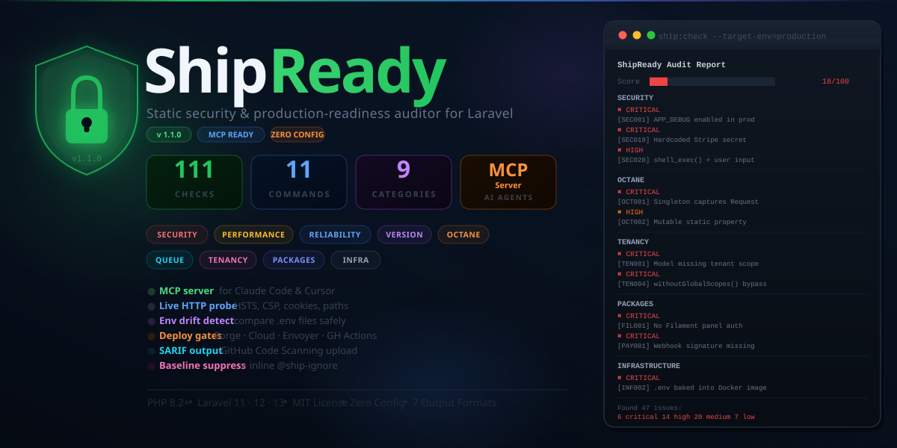
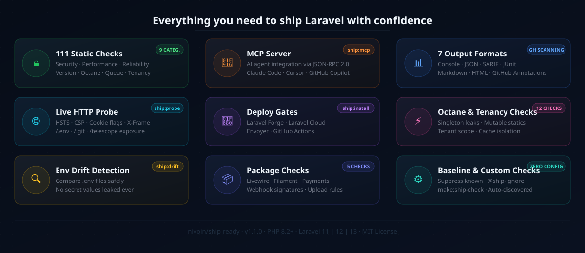

# ShipReady

<p align="center">
  
</p>

<p align="center">
  <a href="https://github.com/nivoin/ship-ready/actions/workflows/tests.yml"></a>
  <a href="https://packagist.org/packages/nivoin/ship-ready"></a>
  <a href="https://www.php.net"></a>
  <a href="https://laravel.com"></a>
  <a href="https://packagist.org/packages/nivoin/ship-ready"></a>
  <a href="LICENSE"></a>
</p>

**The most comprehensive static security, performance, and production-readiness auditor for Laravel 11, 12, and 13.**

ShipReady runs **111 checks** across **9 categories** and catches what others miss: Octane memory leaks, multi-tenant data isolation failures, Livewire/Filament authorization gaps, Docker secrets baked into images, live CVEs from `composer audit`, and more — all without touching your database or making HTTP requests.

Use it as a **Laravel production checklist**, a **CI quality gate**, or an **AI-powered fix engine** via the built-in MCP server that lets Claude Code, Cursor, and GitHub Copilot audit and fix your app automatically.

```
  ShipReady Audit Report  v1.1.0

  Score  ████████░░░░░░░░░░░░░░░░░░░░░░░░░░░░░░░░ 18/100

  INFRASTRUCTURE
  ✖ CRITICAL [INF002] .env file is COPY'd into Docker image — secrets exposed
    Fix: Remove COPY .env. Pass secrets at runtime via env vars or secrets manager.
    Dockerfile

  OCTANE
  ✖ CRITICAL [OCT001] Singleton captures Request — Octane memory leak between requests
    Fix: Inject Request inside methods, never in singleton closures.
    app/Providers/AppServiceProvider.php

  SECURITY
  ✖ HIGH     [SEC001] APP_DEBUG is enabled in production. Stack traces exposed.
    Fix: Set APP_DEBUG=false in your production .env file.
  ✖ HIGH     [SEC019] Hardcoded Stripe secret key found in AdminController.php
    Fix: Move secrets to .env and access via config().
  ✖ HIGH     [SEC020] shell_exec() with user-controlled input — OS command injection
    Fix: Never pass unsanitised user input to shell functions.
    app/Http/Controllers/PostController.php:19
  ▲ MEDIUM   [SEC014] Missing security header: Strict-Transport-Security
    Fix: Add HSTS middleware or use spatie/laravel-csp.

  VERSION SPECIFIC
  ▲ MEDIUM   [VER001] CSRF exclusions in VerifyCsrfToken.php are ignored in Laravel 11+
    Fix: Move CSRF exclusions to bootstrap/app.php withMiddleware().
    app/Http/Middleware/VerifyCsrfToken.php

  Found 25 issue(s): 2 critical, 4 high, 5 medium, 14 low in 3.2s
```

<p align="center">
  
</p>

## Requirements

- PHP **8.2+**
- Laravel **11**, **12**, or **13**

## Installation

```bash
composer require nivoin/ship-ready --dev
```

Laravel auto-discovers the service provider. No configuration publishing required.

## Quick Start

```bash
# Full audit (production mode)
php artisan ship:check --target-env=production

# Security checks only
php artisan ship:check --category=security

# Fail CI on high+ severity only
php artisan ship:check --fail-on=high --ci

# Only check files changed since last commit
php artisan ship:check --changed=origin/main

# JSON output for tooling
php artisan ship:check --format=json --output=report.json

# SARIF for GitHub Code Scanning
php artisan ship:check --format=sarif --output=results.sarif

# Explain a specific check in detail
php artisan ship:explain SEC001

# Live HTTP security probe
php artisan ship:probe --url=https://your-app.com

# Check for env variable drift
php artisan ship:drift

# Route attack surface map
php artisan ship:routes

# Laravel 14 upgrade readiness
php artisan ship:next --target=14

# Generate CI/deploy gate
php artisan ship:install --workflow
```

## Exit Codes

| Code | Meaning |
|------|---------|
| `0`  | No findings at or above `--fail-on` threshold |
| `1`  | One or more findings meet or exceed the threshold |

Default `--fail-on` is `high`. Override in `config/ship-ready.php` or via `SHIP_READY_FAIL_ON=critical`.

## Versioning

ShipReady follows [Semantic Versioning](https://semver.org/).

| Version | Highlights |
|---------|-----------|
| **v1.1.0** | MCP server, Octane/Queue/Tenancy/Packages/Infrastructure checks, 6 new commands, Laravel 11 support, `--ci` and `--changed` flags |
| **v1.0.0** | 86 checks: Security, Performance, Reliability, Version-Specific; 7 output formats; baseline suppression |

## Commands

| Command | Description |
|---------|-------------|
| `ship:check` | Run all checks and report findings |
| `ship:baseline` | Record current findings as baseline to suppress them |
| `ship:explain {ID}` | Detailed explanation and fix guide for a check |
| `ship:list` | Table of all available checks with severity and status |
| `ship:probe` | Live HTTP probe — HSTS, CSP, cookies, sensitive paths |
| `ship:routes` | Attack-surface route map with auth/throttle/CSRF per route |
| `ship:drift` | Detect environment variable drift between .env files |
| `ship:install` | Generate deploy gate config for Forge/Cloud/Envoyer/GitHub Actions |
| `ship:mcp` | Start MCP stdio server for AI agent integration |
| `ship:next` | Laravel upgrade readiness checker (L13 / L14) |
| `make:ship-check {Name}` | Scaffold a custom check class |

## Options

| Option | Default | Description |
|--------|---------|-------------|
| `--target-env` | `production` | Environment to evaluate config against |
| `--category` | all | Filter: `security`, `performance`, `reliability`, `octane`, `queue`, `tenancy`, `packages`, `infrastructure` |
| `--check` | all | Run a single check by ID (e.g. `SEC001`) |
| `--format` | `console` | `console`, `json`, `sarif`, `junit`, `markdown`, `html`, `github` |
| `--output` | stdout | Write report to file path |
| `--fail-on` | `high` | Minimum severity to exit non-zero |
| `--ci` | false | CI mode — only deterministic static checks (no filesystem probes) |
| `--changed` | — | Only check files changed since git ref (e.g. `origin/main`) |
| `--compact` | false | Hide fix hints |
| `--ignore-baseline` | false | Run all checks, ignoring saved baseline |
| `--experimental` | false | Include experimental checks |

## Checks (111 total)

### Security (32)

| ID | Title | Severity |
|----|-------|----------|
| SEC001 | Debug mode enabled in production | critical |
| SEC002 | Application key missing or insecure | critical |
| SEC003 | Vulnerable Composer packages (composer audit) | high |
| SEC004 | Vulnerable npm packages | high |
| SEC005 | Model with no `$fillable` or `$guarded` | high |
| SEC006 | `Model::unguard()` called outside seeder context | high |
| SEC007 | `$request->all()` passed to mass-assignment method | high |
| SEC008 | Raw Blade output `{!! !!}` | medium |
| SEC009 | SQL injection via raw query with variable interpolation | critical |
| SEC010 | Auth routes missing throttle middleware | high |
| SEC011 | Routes excluded from CSRF protection | medium |
| SEC012 | Insecure session cookie (secure/httpOnly/sameSite) | high |
| SEC013 | APP_URL uses HTTP instead of HTTPS | high |
| SEC014 | Missing security headers (HSTS, X-Frame-Options, etc.) | medium |
| SEC015 | CORS wildcard origin with credentials | critical |
| SEC016 | Debug tools exposed in production (Telescope, Debugbar) | high |
| SEC017 | Sensitive files accessible from public/ | critical |
| SEC018 | `env()` called outside config files | medium |
| SEC019 | Hardcoded secrets or API keys in source | critical |
| SEC020 | Dangerous PHP functions with user-controlled input | critical |
| SEC021 | File upload stored to public disk without validation | high |
| SEC022 | Admin routes without authorization middleware | high |
| SEC023 | Sanctum token expiration not configured | medium |
| SEC024 | Weak password hashing configuration | high |
| SEC025 | `signedRoute()` used without `signed` middleware | medium |
| SEC026 | Potential open redirect via user-controlled URL | high |
| SEC027 | API write routes missing rate limiting | medium |
| SEC028 | Sensitive data (password/token) passed to logger | high |
| SEC029 | No HTTP→HTTPS redirect configured | high |
| SEC030 | No Content-Security-Policy header | medium |
| SEC031 | Model exposes sensitive attributes in JSON output | high |
| SEC032 | Timing attack via direct token/hash comparison | high |

### Performance (18)

| ID | Title | Severity |
|----|-------|----------|
| PERF001 | Config not cached | medium |
| PERF002 | Routes not cached | medium |
| PERF003 | Views not pre-compiled | low |
| PERF004 | Composer autoloader not optimized | medium |
| PERF005 | OPcache disabled | medium |
| PERF006 | Slow cache driver in production | medium |
| PERF007 | `Model::all()` called inside a loop | high |
| PERF008 | Possible N+1 query (relation accessed in loop) | high |
| PERF009 | `Model::preventLazyLoading()` not called | low |
| PERF010 | Missing index on foreign key column | medium |
| PERF011 | `->count()` on loaded collection instead of DB query | low |
| PERF012 | Log level set to debug in production | medium |
| PERF013 | Assets not versioned for cache busting | low |
| PERF014 | Heavy operations in `ServiceProvider::boot()` | low |
| PERF015 | File/cookie session driver in production | medium |
| PERF016 | Notification class not queued | low |
| PERF017 | Mailable class not queued | low |
| PERF018 | SQLite driver in production | high |

### Reliability (19)

| ID | Title | Severity |
|----|-------|----------|
| REL001 | Pending database migrations | high |
| REL002 | Task scheduler not configured | medium |
| REL003 | Queued jobs used but queue driver is `sync` | medium |
| REL004 | Failed jobs table not configured | medium |
| REL005 | Mail driver set to `log` or `array` in production | high |
| REL006 | APP_ENV is not `production` | medium |
| REL007 | Public storage symlink missing | medium |
| REL008 | Storage directory not writable | high |
| REL009 | Log channel not configured for rotation | low |
| REL010 | No health check endpoint defined | low |
| REL011 | `.env.example` missing or out of sync | low |
| REL012 | Routes pointing to non-existent controllers | medium |
| REL013 | Multiple DB writes without transaction | medium |
| REL014 | PHP version is end-of-life | high |
| REL015 | No error monitoring (Sentry/Flare/Bugsnag) | medium |
| REL016 | Redis queue without Laravel Horizon | low |
| REL017 | No database backup solution configured | medium |
| REL018 | TrustProxies not configured for HTTPS app | high |
| REL019 | Foreign key column without DB constraint | medium |

### Version-Specific (16)

| ID | Title | Laravel | Severity |
|----|-------|---------|----------|
| VER001 | Old `VerifyCsrfToken` middleware class present | 11+ | medium |
| VER002 | Deprecated `app/Http/Kernel.php` in use | 11+ | low |
| VER003 | AI SDK API key not configured | 13+ | medium |
| VER004 | Reverb not configured with TLS in production | 11+ | high |
| VER005 | Queued job missing `ShouldQueue` interface | any | medium |
| VER006 | Passkey auth missing required configuration | 13+ | medium |
| VER007 | `$this->middleware()` in controller constructor deprecated | 11+ | medium |
| VER008 | Legacy `app/Exceptions/Handler.php` with custom methods | 11+ | low |
| VER009 | `routes/api.php` exists but not registered in bootstrap | 11+ | high |
| VER010 | Livewire v2 installed — incompatible with Laravel 11+ | 11+ | high |
| VER011 | Sanctum SPA missing `SANCTUM_STATEFUL_DOMAINS` | any | high |
| VER012 | `routes/channels.php` defined but broadcasting not enabled | 11+ | medium |
| VER013 | Fortify installed without two-factor authentication | any | medium |
| VER014 | App relies on `TrimStrings` removed from L11 defaults | 11+ | low |
| VER015 | Inertia v0/v1 on Laravel 12+ — needs v2 | 12+ | medium |
| VER016 | Carbon immutable dates not configured | 11+ | low |

### Octane (6)

| ID | Title | Severity |
|----|-------|----------|
| OCT001 | Singleton captures Request or auth state (memory leak) | critical |
| OCT002 | Mutable static property — leaks between requests | high |
| OCT003 | `octane.max_requests` not configured | medium |
| OCT004 | Packages incompatible with Octane detected | high |
| OCT005 | Service provider stores `$app` in static property | high |
| OCT006 | No `RequestReceived` listener to reset service state | low |

### Queue (5)

| ID | Title | Severity |
|----|-------|----------|
| QUE001 | `retry_after` ≤ job `$timeout` — job retried while running | high |
| QUE002 | Queued job makes HTTP call without retry logic | medium |
| QUE003 | `ShouldBeUnique` job with non-atomic cache driver | medium |
| QUE004 | Scheduled commands missing `->withoutOverlapping()` | medium |
| QUE005 | Horizon installed but no production environment configured | medium |

### Tenancy (6)

| ID | Title | Severity |
|----|-------|----------|
| TEN001 | Eloquent model missing tenant scope | critical |
| TEN002 | Queued job missing tenant context | high |
| TEN003 | Cache not isolated per tenant | high |
| TEN004 | `withoutGlobalScopes()` bypasses tenant isolation | critical |
| TEN005 | Central and tenant routes not separated | medium |
| TEN006 | Tenancy + Octane: tenant state not flushed | high |

### Packages (5)

| ID | Title | Package | Severity |
|----|-------|---------|----------|
| LW001 | Livewire public property not `#[Locked]` | livewire/livewire v3 | high |
| LW002 | Livewire file upload missing size/type validation | livewire/livewire | high |
| FIL001 | Filament panel missing `canAccessPanel()` | filament/filament | critical |
| FIL002 | Filament resource without authorization policy | filament/filament | high |
| PAY001 | Webhook route missing signature verification | any | critical |

### Infrastructure (4)

| ID | Title | Severity |
|----|-------|----------|
| INF001 | Dockerfile runs as root user | high |
| INF002 | `.env` file copied into Docker image | critical |
| INF003 | Dockerfile runs `composer install` without `--no-dev` | medium |
| INF004 | `expose_php = On` in php.ini | low |

## AI Agent Integration (MCP)

ShipReady ships an MCP (Model Context Protocol) server that lets AI agents audit your app and suggest fixes without leaving the conversation.

Add to `.mcp.json` in your project root:

```json
{
  "mcpServers": {
    "shipready": {
      "command": "php",
      "args": ["artisan", "ship:mcp"]
    }
  }
}
```

Tools exposed to the agent:

| Tool | Description |
|------|-------------|
| `ship_check` | Run the full audit — returns structured findings with severity, message, and fix |
| `ship_explain` | Explain what a specific check ID detects and why it matters |
| `ship_fix_preview` | Get the fix hint for a specific finding |
| `ship_verify` | Re-run a single check to confirm a fix was applied |

## Environment Drift

```bash
# Compare .env against .env.example
php artisan ship:drift

# Compare staging vs production
php artisan ship:drift --from=.env.production --to=.env.staging
```

## HTTP Probe

```bash
# Probe your production URL for header and path issues
php artisan ship:probe --url=https://your-app.com
```

Checks: HSTS, CSP, X-Frame-Options, cookie flags (HttpOnly, Secure, SameSite), X-Powered-By, and 7 sensitive paths (`/.env`, `/.git/HEAD`, `/telescope`, `/horizon`, etc.).

## Baseline

Suppress known findings without fixing them:

```bash
# Save current findings as baseline
php artisan ship:baseline

# Remove fixed findings from baseline
php artisan ship:baseline --prune
```

Future runs only report new findings (`--diff` mode is automatic when a baseline exists).

## Inline Suppression

```php
// @ship-ignore SEC018 env() needed here for early boot
$value = env('APP_KEY');
```

## Custom Checks

```bash
php artisan make:ship-check MyCustomCheck --category=security --severity=high
```

Place the generated class in `app/ShipReady/` — it is auto-discovered on every run.

## Configuration

```bash
php artisan vendor:publish --tag=ship-ready-config
```

Key options in `config/ship-ready.php`:

| Key | Description |
|-----|-------------|
| `disabled` | Array of check IDs to skip globally |
| `severity_overrides` | Override severity per check ID |
| `fail_on` | Minimum severity for non-zero exit (env: `SHIP_READY_FAIL_ON`) |
| `baseline` | Path to baseline JSON file |
| `editor` | File link protocol: `vscode`, `phpstorm`, `sublime` |

## CI — GitHub Actions

```yaml
- name: Run ShipReady
  run: php artisan ship:check --target-env=production --fail-on=high --format=github --ci
```

Upload SARIF to GitHub Code Scanning:

```yaml
- name: Run ShipReady
  run: php artisan ship:check --format=sarif --output=results.sarif --fail-on=critical

- name: Upload SARIF
  uses: github/codeql-action/upload-sarif@v3
  with:
    sarif_file: results.sarif
```

Generate the workflow automatically:

```bash
php artisan ship:install --workflow
```

## What ShipReady gives you

| Feature | |
|---------|---|
| **111 checks across 9 categories** | Security, Performance, Reliability, Version-Specific, Octane, Queue, Tenancy, Packages, Infrastructure |
| **7 output formats** | Console, JSON, SARIF, JUnit, Markdown, HTML, GitHub Annotations |
| **MCP server (`ship:mcp`)** | AI agent integration — Claude Code, Cursor, GitHub Copilot fix your issues automatically |
| **HTTP probe (`ship:probe`)** | Live security header and sensitive path check against your deployed app |
| **Route attack surface map** | `ship:routes` shows auth, throttle, CSRF, signed middleware per route |
| **Env drift detection** | `ship:drift` compares .env files without leaking secret values |
| **Deploy gate installer** | `ship:install` generates Forge/Cloud/Envoyer/GitHub Actions configs |
| **Laravel upgrade readiness** | `ship:next` checks your app before upgrading to L13 or L14 |
| **GitHub Code Scanning** | Upload SARIF results directly to the Security tab |
| **Baseline suppression** | Record known findings and only surface new ones |
| **Inline `@ship-ignore`** | Suppress individual findings with a comment |
| **Custom check scaffolding** | `make:ship-check` generates a ready-to-use check class |
| **`--ci` mode** | Only deterministic static checks — no network or filesystem probes |
| **`--changed` flag** | Only check files modified since a git ref — fast PR checks |
| **`composer audit` integration** | Live CVE data from the Packagist security advisory database |
| **Exit code control** | `--fail-on=critical\|high\|medium\|low` for precise CI gates |
| **Zero config** | Works out of the box — no publishing required |
| **Laravel 11, 12 &amp; 13** | Full version-specific checks for every modern app structure |

## Contributing

Bug reports and pull requests are welcome on [GitHub](https://github.com/nivoin/ship-ready).

## License

MIT — see [LICENSE](LICENSE)

---

<p align="center">
  <sub>
    Keywords: laravel security audit · laravel production checklist · laravel static analysis · php security scanner · laravel vulnerability scanner · laravel code audit · laravel deployment checklist · laravel performance audit · laravel best practices · composer audit · laravel security headers · artisan security check · laravel health check · laravel pre-deploy · sarif github scanning · laravel 12 security · laravel 13 security · php static analysis tool · laravel code quality · production readiness checker
  </sub>
</p>
